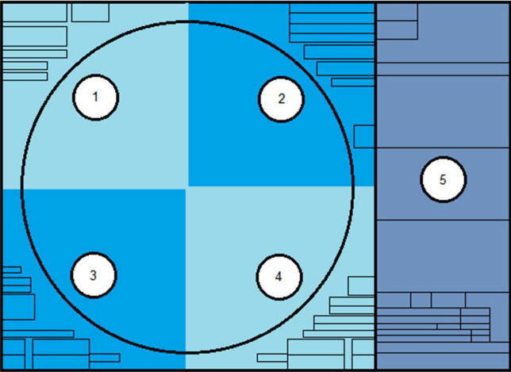
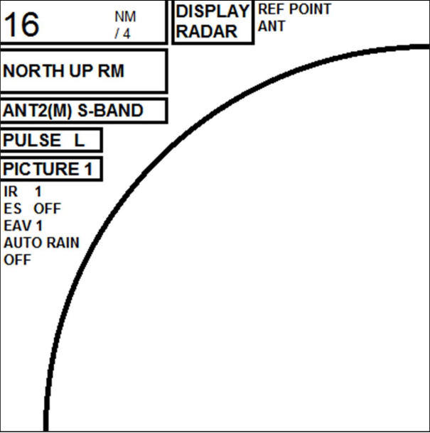
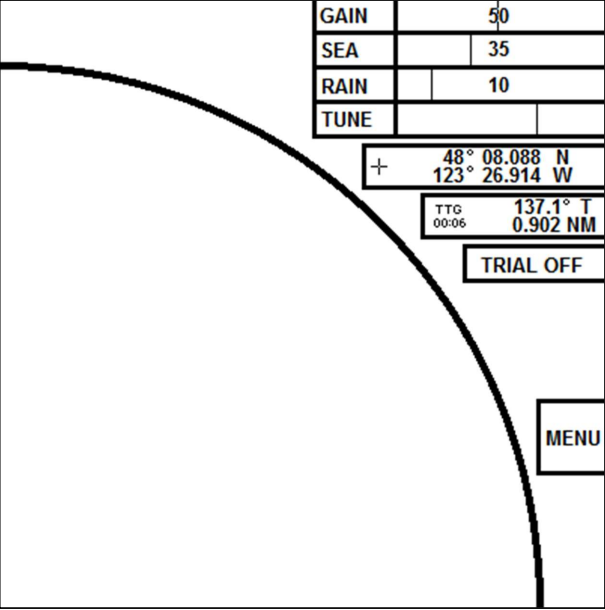
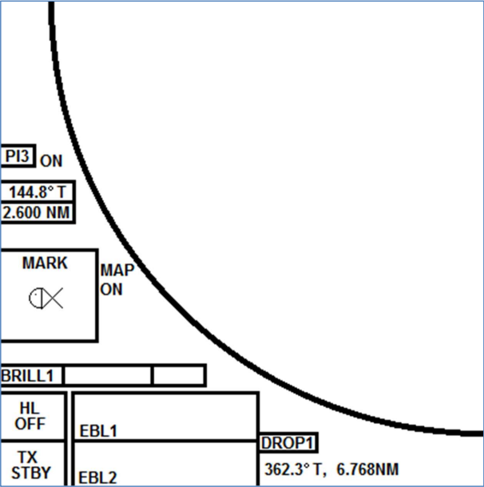
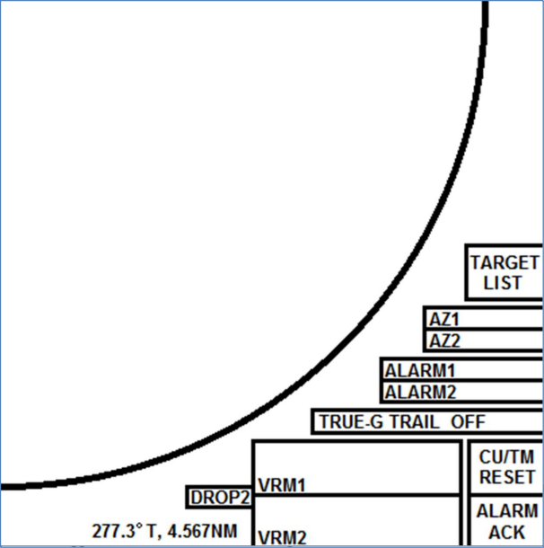

# Operating a Veteran-class Furuno Radar

:::info

This is a small section of the 81-page "Survival Guide" that I wrote for new cadets joining my ship, prior to transitioning to full-time technical writing.

:::

This section of the guide will cover the functions specific to the Furuno Radars installed aboard OSG’s Veteran Class tankers. We won’t be covering basic electronic navigation or collision avoidance, although there will be some tips and tricks.

The radar display will be split into five sections, four quadrants and the information screen on the right side. Each will be covered separately.

## Upper Left

Starting with the top left of the display, we see the **Range**, which shows us both the overall range that the radar is currently set to and the distance between rings if they are displayed.

Next to this is the **Display Type**, which can be changed from Radar display to Plotter. The Plotter display adds latitude and longitude and removes the outer ring of the radar.

The last section of the top line is the **Reference Point**. This can be used to offset the radar display from the Antenna location to the Consistent Common Reference Point or CCRP. This is a location on your ship, preset into the radar, where all horizontal measurements (Range, Bearing, Relative Course, Relative Speed, CPA and TCPA) are normally referenced.

The next line is the radar display’s **Orientation**, and can be set between North Up, Course Up and Head Up. You can also choose between True Motion and Relative Motion.

The third line is the radar display’s **Antenna**, or whether it is using the XBand (3cm) or S-Band (10cm) radar.

The fourth line is the **Pulse Length**. A longer pulse gives greater accuracy at a distance, while a short pulse gives more detail at a shorter distance.

The fifth line is the automatic **Picture** set up. You can choose between multiple preset configurations specifically for certain scenarios. There are four user defined Pictures (1 – 4), then Near, Near Buoy, Harbor, Rough Sea, Far, Far Buoy, Coast and Ship. Most of these settings are designed for 12 NM or less, save for Far Buoy and Ship, so you’re better off using Picture 1 with your own settings in most scenarios.

Below the boxes, the first option is **IR or Interference Rejector**, which aids in the reduction of clutter due to other radars operating in the area. If you are having strange radar readings, and there are multiple other ships in the area, try increasing your IR setting.

Next is **Echo Stretch**, which enlarges targets in the range and bearing directions to make them easier to see. (This will also stretch sea clutter!)

The third text option is **EAV or Echo Averaging**. This option reduces sea clutter by only showing radar returns that have a stable, repeating return. This will significantly reduce random sea clutter that appears in constantly differing locations. Each scan of the radar will reduce randomized sea clutter in brilliance, until it is no longer visible.

The final option is **Auto Rain**, which is similar to options we’ll cover in the upper right quadrant. It will automatically adjust to remove interference and clutter from rain storms.

:::warning

Auto Rain reduces much more clutter than other options. Small, fast moving targets can be removed along with rain clutter. A target that the radar believes is sea clutter, may just be a small fishing boat enroute to collision.

:::

## Upper Right

At the top of the Upper Right Quadrant, we have selectors for the three picture modification slides. **Gain**, **Sea** and **Rain**.

**Gain** adjusts the sensitivity of the radar receiver. The higher you set your gain, the more aggressive the radar return will be.

**Sea** adjusts sea clutter.

**Rain** adjusts rain clutter.

Next is the **Tune** bar, which should be set to auto and should generally return a bar that is about 2/3 full. If it is significantly outside of this range, you should look into having the radar serviced.

:::note

As you lower your range, you will require less gain. 50 may be okay for a 16 or 24 nm scale, while 15 to 20 may be plenty for one to three nautical miles.

:::

Below these four sliders is the **Cursor Position**, which will return the Latitude and Longitude of your cursor location on the radar screen.

Next is the **Range**, **Bearing** and **Time To Go** of your cursor. You can also set this to show an X/Y coordinate in nautical miles of your cursor, with the ship as the center of the plane.

You can also set and use the **Trial** function, which should function the same as the Trial Mode of whatever radar you took your electronic navigation class on.

The large **Menu** button functions the same as the Menu button the keyboard.

## Lower Left

The Lower Left Quadrants starts with your **Parallel Index Lines**. You can scroll through PI 1-6 and activate them by left clicking. You can thenadjust the bearing and distance using either the mouse’s scrollwheel, orthe EBL/VRM dials on the keyboard.

Below this is the **Mark Selector**. You can scroll through all the available navigation marks, which can then be placed on the radar by clicking **Enter
Mark** on the keyboard. **Map On/Off** indicates whether the user placed marks will appear or not.

The **Brilliance** slider is below this and can be used to switch between preset color palettes, and to adjust the overall brightness of the screen. You can also right click on the slider to bring up the Brilliance Menu, where specific colors can be modified. 

In the far lower left corner, you have **HL OFF**, which allows you to turn off the header line, and **TX STBY**, which toggles the radar between transmitting and standing by.

To the right of this are the two **EBL boxes**. Clicking will activate them, after which you can use the EBL dial on the keyboard to adjust them.

The final option here is the first **Drop Mark**. These marks can be used to measure the range and bearing of a fixed point. To turn off a Drop Mark, hold down the left click button on top of the DROP1 or DROP2 box.

:::warning

Drop marks will remain stationary, even if the ship moves a significant distance away. Always clean up your drop marks when you're done using them.

:::

## Lower Right

The final Lower Right Quadrant starts with the **Target List** box, which will display a list of all AIS targets sorted by distance. The list will appear to the right in the information boxes.

The next set of boxes are the two **Acquisition Zone** selectors, which will allow you to set up a zone where any return passing through will be auto acquired as a TT Target.

:::warning

Alarm zones should not be used for acquiring TT targets in lieu of the Mate on Watch standing an efficient and prudent radar watch. The radar does not know if a target is dangerous or relevant, but you should.

:::

The **Alarm Zones** are similar but will simply alarm when any returns pass through as an early warning.

The **Trails** options are below the acquisition zones and allow you to set the radar to return a trail behind all radar returns. This can be used to further determine the past movements of a vessel.

To the far left on the bottom row is the second **Drop Mark** and functions the same as the first in the lower left quadrant.

Your two **VRM** boxes can be clicked to activate their respective VRMs, which can be altered by using the VRM dial on the keyboard.

The **CU/TM reset** will reset the ship’s location the radar when you are using a True Motion mode. It will place your current course up and the ship ¼ of the total radar distance from the edge currently astern.

Finally, the **Alarm Ack** button will acknowledge any radar alarms you get.
